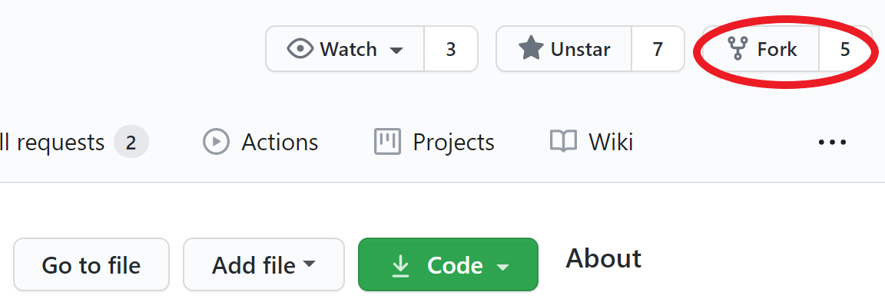
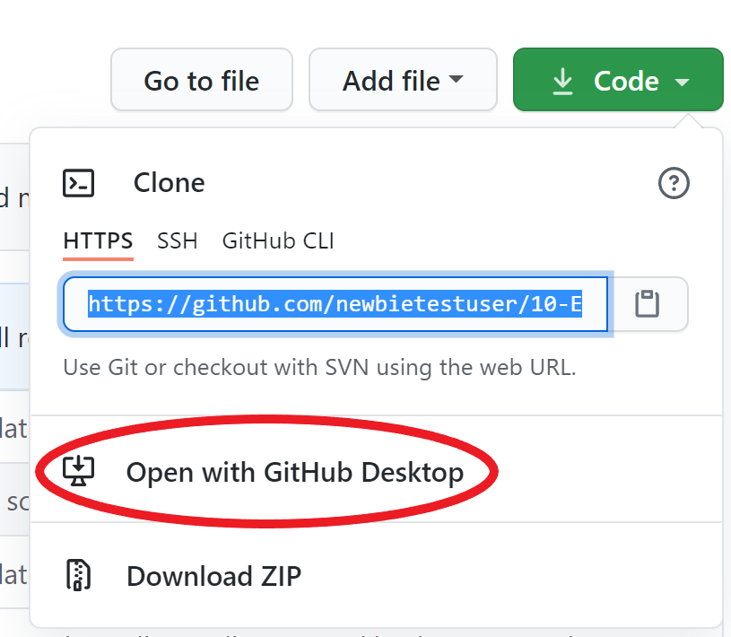
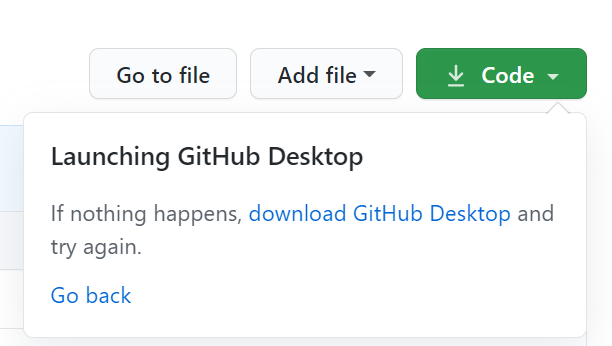
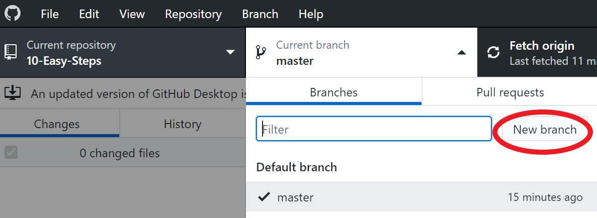
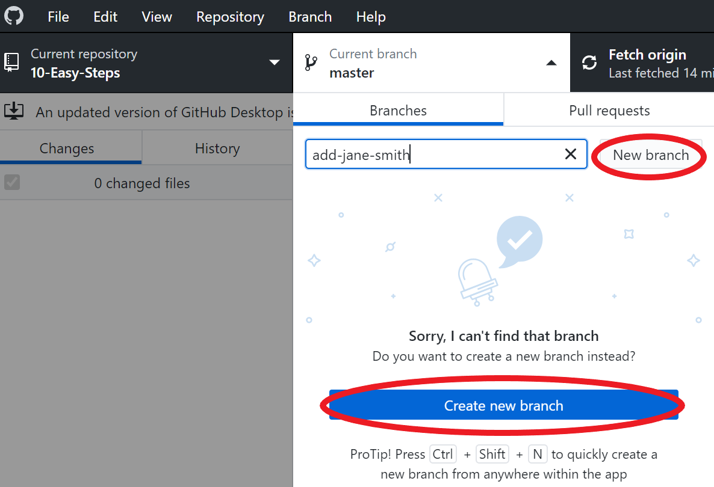
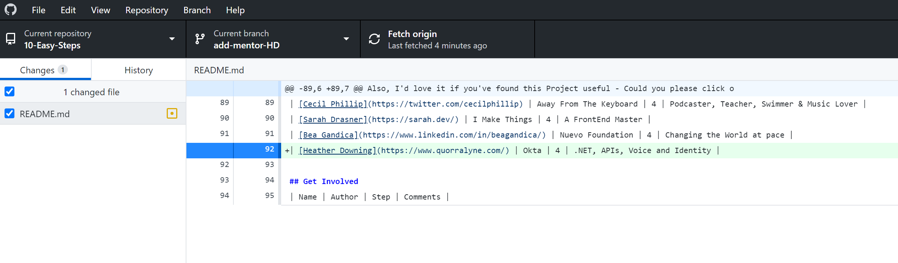

# GitHub Desktop Tutorial for 10-easy-steps

||GitHub Desktop Edition|
|---|---|

It's hard. It's always hard the first time you do something. Especially when you are collaborating, making mistakes isn't a comfortable thing. But open source is all about collaboration & working together. We wanted to simplify the way new open-source contributors learn & contribute for the first time.

Reading articles & watching tutorials can help, but what comes better than actually doing the stuff without messing up anything. This project aims at providing guidance & simplifying the way rookies make their first contribution. Remember the more relaxed you are the better you learn. If you are looking for making your first contribution just follow the simple steps below. We promise you, it will be fun.

If you don't have GitHub Desktop on your machine, [install it](https://desktop.github.com/).

If you're using a version of GitHub desktop before 1.0, we recommend you upgrade to the latest version.

## Fork this repository

Fork this repo by clicking on the fork button on the top right of this page.
This will create of copy of this repository in your account.

## Clone the repository

Now clone this repo to your machine.

IMPORTANT: DO NOT CLONE THE ORIGINAL REPO. Go to your fork and clone it.

To clone the repo, click on "Clone or Download" and then click on "Open in Desktop".

A pop up window will open. Click on "Open GitHubDesktop.exe".

After you click on "Open GitHubDesktop.exe" the contents will be downloaded to your computer.

Now you have copied the contents of the first-contributions repository in github to your computer.

## Create a branch

Now create a branch by clicking on the "Current branch" icon at the top and then click on "New branch":

Name your branch <add-your-name>. For example, "add-jane-smith"

Click on `Create branch`

## Make necessary changes and commit those changes

Now open `readme.md` file in a text editor, scroll to the section you want to edit, make the changes, then save the file.

Example: If the resource name you are adding is Heather Downing, It should look like this.

\[Heather Downing](https://www.quorralyne.com/) | Okta | 4 | .NET, APIs, Voice and Identity |

You can see that there are changes to Contributors.md and they have been added to the Github Desktop.

Now commit those changes:

Write the message "Add `<resource-name>` to `<mentors>` list" in the *summary* field.

Replace `<resource-name>` with the details you are adding.

Click on the button that says `Commit to add-resource-name`.

At the bottom, you can see that the commit has been created.

## Push changes to github

Click on File->Options and sign-in to Github.com. Type in your Github username and password. If you haven't already logged in.

Click the `Publish` button on the top right.

## Submit your changes for review

If you go to your repository on github, you'll see  `Compare & pull request` button. click on that button.

Now submit the pull request.

Soon I'll be merging all your changes into the master branch of this project. You will get a notification email once the changes have been merged.

## Where to go from here?

Congrats!  You just completed the standard _fork -> clone -> edit -> PR_ workflow that you'll encounter often as a contributor!
